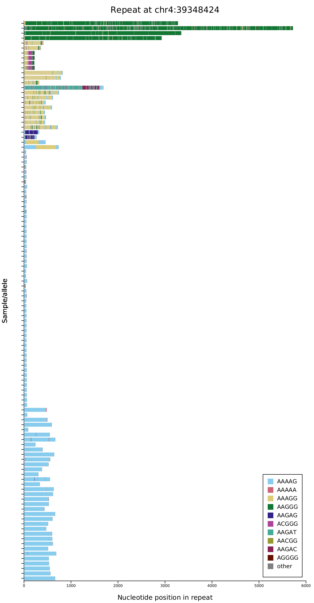

# aSTRonaut

[](https://github.com/wdecoster/aSTRonaut/actions/workflows/test.yml)

Visualise the motif composition of short tandem repeats (STRs) as a "barcode"
plot: one row per sample/allele, with every nucleotide coloured by the repeat
motif that covers it. It reads VCFs from STR genotypers
([STRdust](https://github.com/wdecoster/STRdust), LongTR) or a simple TSV table,
and writes interactive HTML or static images.

This is a fast, dependency-free reimplementation (a single binary, no Python
needed) of the sequence-composition view from
[pathSTR](https://pathstr.bioinf.be/).



## Installation

Download a prebuilt binary for your platform from the
[releases page](https://github.com/wdecoster/aSTRonaut/releases) (Linux,
static Linux/musl, and macOS), make it executable, and put it on your `PATH`.

Or build from source with a [Rust toolchain](https://rustup.rs/):

```bash
cargo install --path .
# or: cargo build --release  → target/release/aSTRonaut
```

## Quick start

```bash
# One repeat from several samples → interactive HTML (default)
aSTRonaut *.vcf.gz --repeat chr4:39348424 -o rfc1.html

# Let aSTRonaut pick the motif length for each repeat
aSTRonaut *.vcf.gz -k auto -o plots.png

# Cluster rows by motif so similar alleles group together
aSTRonaut *.vcf.gz --repeat chr4:39348424 --sort motif -o rfc1.png

# Collapse identical alleles into a haplotype-frequency view
aSTRonaut *.vcf.gz --repeat chr4:39348424 --collapse -o rfc1_collapsed.html

# Publication-ready figure
aSTRonaut *.vcf.gz --repeat chr9:27573484 --publication -o c9orf72.pdf
```

In the interactive HTML, hover a segment to see its sample, motif and position,
and use the search box to highlight a sample or a motif.

## Options

Run `aSTRonaut --help` for the full list. The most useful:

| Option | What it does |
|--------|--------------|
| `--repeat chr:pos` | Plot a single repeat coordinate (default: all repeats found) |
| `-k, --kmer` | Motif length to colour by (default 3). `-k auto` detects it per repeat (a heuristic; pass an explicit length to override) |
| `-n, --number` | How many distinct motifs to colour (default 10) |
| `--motifs AAAAG,AAGGG` | Colour these specific motifs instead of the most frequent ones |
| `--sort` | Row order: `length` (default), `alphabetic`, or `motif` (cluster by composition) |
| `--collapse[=FRAC]` | Collapse identical alleles into one row with an allele-count panel; `--collapse=0.05` also merges near-identical sequences (handles sequencing error) |
| `--sampleinfo FILE` | TSV (`name`, `group`) marking `case` samples; splits the collapse counts into case/control |
| `--somatic` | Plot per-read sequences (from the `SEQS` field of somatic VCFs) |
| `-m, --minlen` | Minimum allele length to plot (default 20) |
| `--publication` / `--minimal` | Cleaner styling for figures |
| `--title`, `--height`, `--width`, `--size`, `--legend_corner`, `--hide-labels` | Appearance tweaks |

Height auto-scales with the number of samples, so labels stay legible for large
cohorts.

> **A note on `-k auto`:** motif-length detection is a heuristic (it takes a
> consensus across the alleles and corrects for base composition). It works well
> across loci, but no heuristic is perfect — if a plot's motifs look off, set the
> length explicitly with `-k`.

## Input and output

**Input** is one or more single-sample VCFs (plain or bgzip-compressed) with
`CHROM`, `POS`, `ALT` and a `GT` genotype, or a TSV table (`--table`) with `name`
and `sequence` columns.

**Output** format is chosen from the file extension:

| Extension | Output |
|-----------|--------|
| `.html` | Interactive plot (hover + search), all repeats in one file |
| `.svg` / `.png` / `.pdf` | Static image, one file per repeat |

## Citation

If aSTRonaut was useful for your work, please cite our publication:

> De Coster *et al.*, *Genome Research* (2024).
> <https://genome.cshlp.org/content/34/11/2074>

## Acknowledgements

Plots are rendered with [kuva](https://psy-fer.github.io/kuva/), VCFs are parsed
with [noodles](https://github.com/zaeleus/noodles), and the motif-length
detection is ported from [trout](https://github.com/wdecoster/trout). Example
plots use data from the [pathSTR](https://pathstr.bioinf.be/) database.

## Further reading

Implementation details (motif detection, collapsing, rendering) are documented in
[docs/internals.md](docs/internals.md).
